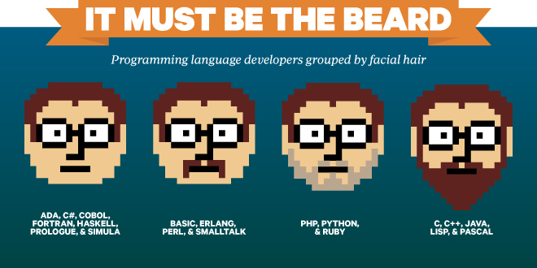
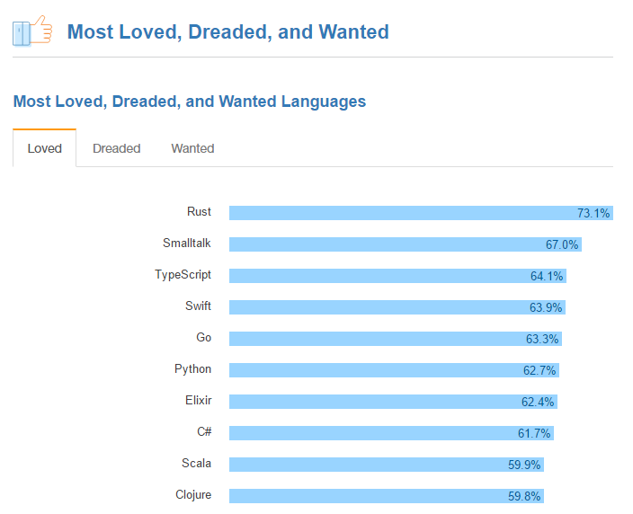

# Beyond C#7 - All You'll Ever Need To Know


Following the development of the C# language over the last decades has been amazing. When Microsoft unveiled C# 1.0 at the dawn of the 21st Century, industry veterans were [skeptical](http://www.artima.com/weblogs/viewpost.jsp?thread=6543), seeing it as little more than a boring alternative to Java. James Gosling essentially called it [a stupid imitation](https://www.cnet.com/news/why-microsofts-c-isnt/) of his brainchild. Despite the odds, the team behind the C# language, lead by one Anders Hejlsberg (who doesn't even [have a beard](https://www.wired.com/2012/06/beard-gallery/)) has continued to impress us with their ingenuity and pragmatic direction.


<sub>Figure 1: programming language designers by facial hair. Image: [Wired](https://www.wired.com/2012/06/beard-gallery/)</sub>

Now at[ version 7](https://blogs.msdn.microsoft.com/dotnet/2017/03/09/new-features-in-c-7-0/), C# has become a cross platform, multi-paradigm language with[ many](https://msdn.microsoft.com/en-us/library/bb308959.aspx)[ innovating](https://msdn.microsoft.com/en-us/library/bb397951%28v=vs.110%29.aspx)[ features](https://msdn.microsoft.com/en-us/library/mt674882.aspx). It's [well-loved](https://stackoverflow.com/insights/survey/2017#most-loved-dreaded-and-wanted) by the developer community, and has become a source of inspiration for other languages like[ Javascript](https://tc39.github.io/ecmascript-asyncawait/) and even[ Java](https://jcp.org/en/jsr/detail?id=335).


<sub>Figure 2: StackOverflow's [survey result]((https://stackoverflow.com/insights/survey/2017#most-loved-dreaded-and-wanted)) showing C# as one of the most loved programming languages</sub>

Now it's worth mentioning that there are no modern programming languages that's ever developed in a vacuum. Programming language design is a fertile field with a lot of cross pollination between academia and industry. As a language for programmers in the industry, C# is no exception. It draws inspiration from a myriad of sources, from classical languages like C++, Java and Pascal, to dynamic ones like Ruby, Python and Javascript, to functional like [Haskell](https://www.haskell.org/), [OCaml](https://ocaml.org/) and most prominently its close cousin [F#](http://fsharp.org/).

With each new C# version, there's a clear trend toward functional programming. In fact, C#'s continued relevance over the years owes a lot to the ideas that it has adopted from the functional world. Imperative and OOP features still have their places in the language, but they're increasingly being retrofitted, or glossed over by functional and declarative constructs.

**_In this article, we will go over some important "pillars" of functional programming to see how the C# team has incorporated them into their language and take a look at what they might be planning for the future._**

## Generics and type inference

Generics, or [parametric polymorphism](https://en.wikipedia.org/wiki/Parametric_polymorphism), is basically the ability for programmers to handle similar kinds of data with one code base. And doing more with less is always a good thing. Generics is the foundation upon which many advance features are implemented. It is the bread and butter of any self-respecting language with a type system.

Although generics is relatively simple to use from a working programmer's perspective, any language designers would know that it is a huge feat of engineering to implement. Java has generics a bit earlier than C#, but their implementation suffers from the problem of type erasure, which means the type parameter is known only at the compiler level, and it is lost (erased) when compiled to JVM bytecode.

* C#'s generics was released with C# 2.0 in 2005, the result of the collaboration with Microsoft Research in Cambridge, UK - a place famous for functional researches. The team decided to make the effort to implement reified generics, which means type information is preserved all the way down to the CLR. It is said that, without that great undertaking to implement reified generics, later development of C# would be [severely limited](https://blogs.msdn.microsoft.com/dsyme/2011/03/15/netc-generics-history-some-photos-from-feb-1999/). For example; there would be no LINQ in C#3, no Task Parallel Library in C#4, and no async/await in C#5. Amusingly, Don Syme, who worked on C# generics went on to lead the design of F#.

* C#3 in 2007 introduced the var keyword and better generic type inference in method invocation, where the compiler can infer the type based on what's being used. While not specific to generics, this feature alleviates a lot of verbosity when declaring generic variables. Amusingly, many developers mistook this for C# having a dynamic type system, which it totally doesn't. 

* C#4 in 2010 added [covariance and contravariance](https://docs.microsoft.com/en-us/dotnet/articles/csharp/programming-guide/concepts/covariance-contravariance/index), which allowed greater reuse of generic types.

Future development in this area includes [default value for generic type parameter](https://github.com/dotnet/csharplang/blob/master/proposals/target-typed-default.md), and better type inference in [specific cases](https://github.com/dotnet/csharplang/blob/master/proposals/nullable-enhanced-common-type.md). There are more exciting stuffs from the functional world like  [automatic generalization](https://docs.microsoft.com/en-us/dotnet/articles/fsharp/language-reference/generics/automatic-generalization) and [Hindley Milner type inference](https://en.wikipedia.org/wiki/Hindley%E2%80%93Milner_type_system) that make it really ergonomic to use generic code in languages like F# or Haskell. However, due to its C++ and OOP lineage, there's little chance that C# will develop those two features.

## Functions as first class citizens

Have you ever wondered, what would happen if we could declare functions as easily as declaring a string, or combine functions as naturally as adding two integers? Haskell users have been enjoying functions as a first class citizen like that for a long time. C# got the first part, declaring functions, with its lambda expressions at version 3, and it was instrumental to the success of LINQ. There was also method group conversion and static using in C#6, which helps passing functions around as delegates that much easier.

Haskell and F# also have dedicated operators to compose and chain functions together. They also have an automatic currying process (named after [Haskell Curry](https://wiki.haskell.org/Currying)), which can turn functions with any number of parameters into functions with one parameter for composing. Because of this feature duality, we can often see a style in functional code where the programmer prepares a bunch of small, testable functions, then weave them into a chain of computation, and finally pipe in the data at the last step: 

```fsharp
let items = [1..100]
let isEven n = n % 2 = 0
let square n = n * n
let sumOfSquaresOfEvenNumbers = 
    List.filter isEven >>
    List.map square >>
    List.reduce (+)
let result = items |> sumOfSquaresOfEvenNumbers
printfn "%A" result
```
<sub>Figure 3: example of functional style in F#</sub>

This coding style is highly testable and tremendously reduces the need for elaborate mocking. This is in contrast to the OOP approach, where, in the [word](https://www.amazon.com/gp/product/1430219483) of Joe Armstrong of Erlang fame: "You wanted a banana but what you got was a gorilla holding the banana and the entire jungle."


Extension methods in C#3 helps a bit in this regard in order for us to have code that resemble a chain of computation:

```csharp
var items = Enumerable.Range(1, 100);
Func<int, bool> isEven = n => n % 2 == 0;
Func<int, int> square = n => n * n;
var result = items
    .Where(isEven)
    .Select(square)
    .Aggregate((sum, item) => sum + item);
Console.WriteLine(result);
```
<sub>Figure 4: example of method chaining in C#</sub>

Unfortunately, once again, due to its OOP lineage with so many methods in the BCL having overloads, C# will probably never see anything like native currying and built-in functions composition. We will have to look to user-land libraries like the excellent [lang-ext](https://github.com/louthy/language-ext) for that need.

## Everything is an expression

Most constructs in a programming language can be divided into 2 kinds: statements and expressions. Statements are all about side effects, while expressions are all about values. Expressions are typically shorter and more composable than statements, which depends on specific ordering to make sense. In the far end of the functional spectrum, there is the LISP family of languages (Scheme, Clojure) where everything is an expression. Any program, however complex, can be composed from a tree of small,reasonable and testable expressions. A high degree of composability is also a good thing. 

Obviously, C# will never go that far, and it will never become a full-fledged functional language. However, historically, the designers have been paying attention to making the language more expressive. There are a lot of features that enabled developers to replace statements with expressions where it makes sense:

* C#3 introduced [lambda expression](https://docs.microsoft.com/en-us/dotnet/articles/csharp/programming-guide/statements-expressions-operators/lambda-expressions), which allowed functions to be passed around freely, eliminating the need for boilerplates in the form of intermediary objects. This revolutionized the way APIs in libraries and frameworks were written for C#.
* C#3 also added the object and collection [initialization expressions](https://docs.microsoft.com/en-us/dotnet/articles/csharp/programming-guide/classes-and-structs/object-and-collection-initializers), making it very succinct to declare complex data structure.
* In C#6, we can start replacing [method bodies](https://github.com/dotnet/roslyn/wiki/New-Language-Features-in-C%23-6) with lambda expressions, making class declarations really terse.
* C#7 introduced the [is expression](https://github.com/dotnet/roslyn/blob/master/docs/features/patterns.md). This is an important foundation for powerful pattern matching down the road.
* The `out` keyword, widely regarded as an ugly hack for multiple returns, can now have an [assignment expression right inside](https://github.com/dotnet/csharplang/blob/master/proposals/csharp-7.0/out-var.md), reducing the need for a clunky variable declaration in front of it.
* For better or worse, [throw](https://github.com/dotnet/csharplang/blob/master/proposals/csharp-7.0/throw-expression.md) is now also an expression in C#7.

For future versions, there are many proposals in the same vein:

* As part of the pattern matching proposal, there will be a [match](https://github.com/dotnet/csharplang/blob/master/proposals/patterns.md) expression, which will be able to replace `if` and `switch` statements in many cases.
* For easy cloning and modifying of existing data structure, there will be a `with` expression as part of the [record](https://github.com/dotnet/csharplang/blob/master/proposals/records.md) proposal.

All in all, we're looking at a very "[expressive](https://github.com/dotnet/csharplang/issues/63)" C# in a near future.

## Powerful type system

In functional languages, there is a trio of features that blend together in harmony so that working with data becomes a really pleasant experience:

* **The Algebraic type system** allows users to succinctly compose a new type from existing ones, then creates instances of that type just as easily.
* **Pattern matching** for testing if a piece of data matches a certain shape and size of a type
* **Destructuring** to make extracting pieces of data from a container just as natural as putting them in.

Looking at the activities on [github](https://github.com/dotnet/csharplang), we can see that the designers of C# are definitely working toward this goal.

### Algebraic data type:

One criticism toward classical OOP and their type system is that it is too rigid and inflexible, in areas where the only natural way to re-use types is to extend them. Very often do We see the textbook OOP hierarchy of cats, dogs, birds and human inheriting from animals breaking spectacularly in a real world projects.

When faced with existential crisis about types, some folk came up with questions similar to ones that were asked about functions: just as we can add or multiply integers, can we do the same with types? It turns out that we can, and the results are product type and sum type.

#### Product type

Product type is the result of multiplying types together. Classes in traditional OOP languages are product types. However, they were originally designed to house many things aside from data like methods, events, indexers... so they can be unnecessarily verbose to be used as data type. The designers of C# are adding tuples and records to the language to help in this regard.

A **tuple** is basically an ordered sequence of values of different types. The concept of Tuples were introduced to C# back in version 4, but it was clunky and almost nobody uses it. [Tuples in C#7](https://github.com/dotnet/roslyn/blob/master/docs/features/tuples.md) gets a lot of compiler love, making it really easy to put data in a tuple, passes it around and extract data from it. Expect lots of code where multiple returning values or intermediary classes can be eliminated and replaced with tuples in the future.

```csharp
public (int sum, int count) Tally(IEnumerable<int> values) 
{
    var s = 0; var c = 0;
    foreach (var value in values) { s += value; c++; }
    return (s, c); // target typed to (int sum, int count)
}
```
<sub>Figure 5: tuple in C#7</sub>

A **Record** is a simple container of named values. It's like classes, but really succinct and typically don't have any methods. There's a really promising [proposal for records](https://github.com/dotnet/csharplang/blob/master/proposals/records.md) in future C#.

```csharp
public sealed class Point(int X, int Y);
...
var point = new Point(3, 4);
var cloned = point with { X = 5 };
```
<sub>Figure 6: proposed record syntax in future C#</sub>

#### Sum type

Sum type is the result of adding types together. It's also known as tagged union or [discriminated union](https://docs.microsoft.com/en-us/dotnet/articles/fsharp/language-reference/discriminated-unions) in F#, or [case class](http://docs.scala-lang.org/tutorials/tour/case-classes.html) in Scala. It is useful for expressing a lot of tricky data situation, for example:

* A function returning some data or none
* An operation that either evaluate to a value successfully or encountered an error
* An API that returns a 301 redirect or JSON content

* The various actions that can be performed on an interface (a button click, a key down...)
 
```fsharp
type Shape =
    | Rectangle of width : float * length : float
    | Circle of radius : float
    | Prism of width : float * float * height : float
```
<sub>Figure 7: example of sum type in F#</sub>

Traditional OOP languages also have sum type in the form of `enum` but they are often underused and underpowered. C#'s [current enum implementation](https://docs.microsoft.com/en-us/dotnet/articles/csharp/language-reference/keywords/enum) is severely crippled, as it cannot hold different data types. In contrast, new languages like [Swift](https://developer.apple.com/library/content/documentation/Swift/Conceptual/Swift_Programming_Language/Enumerations.html) and [Rust](https://doc.rust-lang.org/book/enums.html) got their enum right and they can be used in place of tagged union.

There's a [proposal](https://github.com/dotnet/csharplang/issues/113) for proper discriminated union in C# and there's clear intent from the team to start work on it some time in the future.

#### No Null

Another aspect where functional type system really shine is the banishment of the [billion-dollar mistake](https://www.infoq.com/presentations/Null-References-The-Billion-Dollar-Mistake-Tony-Hoare): null reference. Null is dangerous in Java and C# because the type system allows it to be a member of all reference types. Null claims to support the contract of a type but that claim is a lie. Null is like a timed bomb that blows up when we try to use it, often at the most embarrassing moment. In contrast, functional languages use the sum type [Maybe](http://package.elm-lang.org/packages/elm-lang/core/latest/Maybe) or [Option](https://docs.microsoft.com/en-us/dotnet/articles/fsharp/language-reference/options) to handle missing values. An Option represent a value that can be either **something** or **none**. Unlike null, **none** is not a member of any other type, it doesn't claim to support any contract and will [never blows up](https://blogs.msdn.microsoft.com/dsyme/2013/03/25/quote-of-the-week-what-can-c-do-that-f-cannot/), as the compiler forces you to check for it whenever it encounters an Option.

C# can never go back on null without breaking backward compatibility. However, that doesn't mean the designers can't find ways to make handling of nulls easier. In C#6, there was the [conditional operator](https://docs.microsoft.com/en-us/dotnet/articles/csharp/language-reference/operators/null-conditional-operators) `?.` for safely accessing nullable members. We've seen developers using this feature to great success in the wild. Future version of the C# compiler will likely have the ability to [track usage of nulls](https://github.com/dotnet/csharplang/blob/master/proposals/nullable-reference-types.md) and warn users where appropriate.

### Destructuring assignment

While only marginally useful when used on its own, this feature becomes much more powerful when paired with pattern matching. After we have tested that the incoming data match a certain shape and size, we can immediately break it apart and do useful things with its members. [Deconstruction protocol](https://github.com/dotnet/roslyn/blob/master/docs/features/deconstruction.md) landed in C#7, and any type can be deconstructed.

```csharp
class Point
{
    public int X { get; }
    public int Y { get; }

    public Point(int x, int y) { X = x; Y = y; }
    public void Deconstruct(out int x, out int y) { x = X; y = Y; }
}
...
(var myX, var myY) = GetPoint(); 
```
<sub>Figure 8: destructuring in C#7</sub>

### Pattern matching

F# has it and C#'s gonna have this [nice thing](https://github.com/dotnet/csharplang/blob/master/proposals/patterns.md) soon. When this feature lands, we would expect the gradual fading away of `if` and `switch` statements, as the coming `match` expression is a much more powerful and succinct construct:

```csharp
var areas =
    from primitive in primitives
    let area = primitive switch (
        case Line l: 0,
        case Rectangle r: r.Width * r.Height,
        case Circle c: Math.PI * c.Radius * c.Radius,
        case *: throw new ApplicationException()
    )
    select new { Primitive = primitive, Area = area };
```
<sub>Figure 9: proposed pattern matching syntax in future C#</sub>

## Conclusion

For programmers looking to enter the field, C# is an good starting point in term of its practicality and paradigms it has adopted. C# has evolved since its inception and we can learn a lot from its journey. It's beneficial for your long-term development as a programmer, whether you're using C# or not, or you are planning to make the leap to other "real" functional languages like F#, Scala or Elm....

**_Do you Agree or Disagree? Tell us what you think here_**
